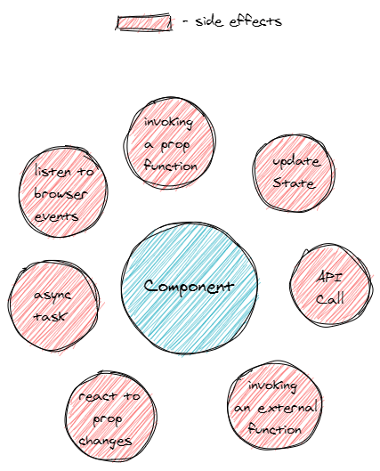
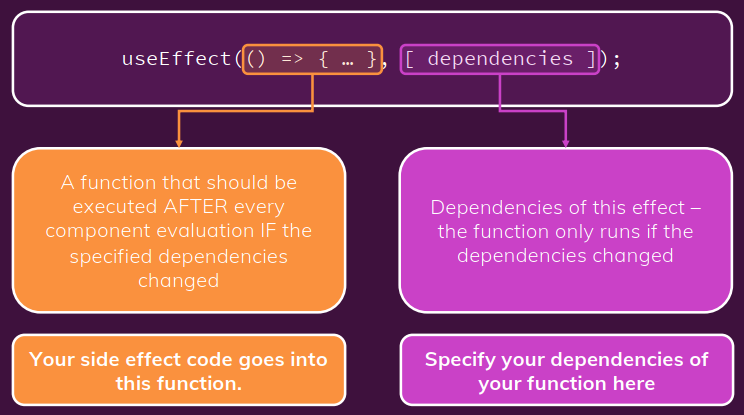
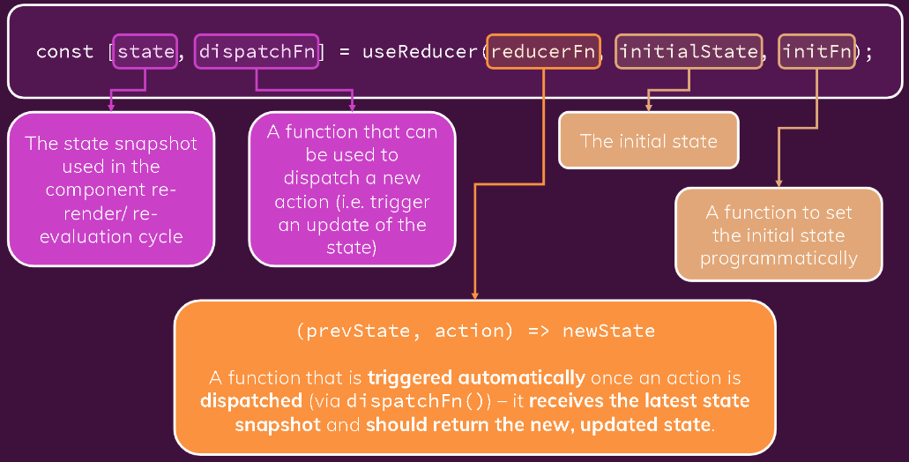

# `useEffect` & `useReducer` hooks examples

In this repo you will find two examples of advanced _React Hooks_ `useEffect() and useReducer()`, this two hooks are very important tools for different purposes that I will explain in following sections.

# UseEffect Hook

UseEffect is a hook that react provides to act accordingly a sideEffect on a web app, for example a call to an API is performed making an http request that is not controlled by React so this is a side effect, on the image bellow you can see the typical side effects on a web app.

<p>
  
  <br>
  <em>Typical side effects on a web application</em>
</p>
Once we recognized this side effects, we can use `useEffect()` hook to face this changes, the structure of useEffect is showed bellow.

<p>
  
  <br>
  <em>Structure of the useEffect hook</em>
</p>

two parameters are given the first one is a function and the second one is an array of dependencies, the function on the first parameter will run whenever a value on the dependencies array change, and after the first render of the component where it belongs, in the project folder `useEffectProject/` you can check `src/components/Login/Login.js` to see an example of the hook in the inside `useEffect()` call in the Login component, basically the useEffect function used here implements a technique called debouncing, that is used whenever we want to check the form validity on every keystroke but not taking to much effort on the rerendering, this is done very simple with useEffect.  
For more information about this hook you can check this great [tutorial](https://youtu.be/0ZJgIjIuY7U) and also check the Acknowledgements section where you can find the course of react from udemy.

# UseReducer Hook

This hook is used when managing the state of some variables in our application become cumbersome, great if you need a more manageable tool for handling different states of your application, you can replace `useState()` with `useReducer()`, if you need a more powerfull tool.  
The structure of `useReducer()` is explained in the image bellow. Basically we have a reducer function that will receive the last state of our reducer and manage it, the two new generated values between the `[]` (brackets) are the state inside the React component, and a dispatcher that will execute the reducer function passed via arguments in the hook to handle the state.  
In the file `useReducerandContextAPIProject\src\components\Login\Login.js` you will find an example of this hook.

<p>
  
  <br>
  <em>Structure of the useReducer hook</em>
</p>

# Context API

Context API comes with the need for managing a variable that is present in a lot of components and its use is cunbersome due to the component's tree structure, you can manage it passing that variable between components using `props` but that code will become hard to read specially when the content of that variable changes. See the two images bellow showing an example where the use of context API is ideal, the first one shows the case where the value of some variable is present in various components but to know if its value changed we need a hard to implement system of comunications between this components, on the second image we show the solution where `context API` comes to help us.  
In the files `useReducerandContextAPIProject\src\store\auth-context.js` and `useReducerandContextAPIProject\src\components\MainHeader\Navigation.js` you will find the respective examples of the context API functionality of React.

<p>
  
  <br>
  <em>The administration of one variable becomes hard</em>
</p>

<p>
  
  <br>
  <em>We solve the issue with context API</em>
</p>

_Warning!_ Context API is used for values where its change rate on the application in low, for high change rate elements in the application we will need another tools such as **Redux**.

# How to run the project

To run one of the two root projects `useReducerandContextAPIProject\` or `useEffectProject\` we will put in terminal this commands, for example we will run the `useEffectProject`.

```
$ cd useEffectProject\
$ npm install
$ npm start
```

# Acknowledgements

Thanks to ([Maximilian Schwarzmüller](https://www.linkedin.com/in/maximilian-schwarzmueller/)) and his great React course on Udemy from where I extracted this content [Complete React Course](https://www.udemy.com/course/react-the-complete-guide-incl-redux/). I am learning a lot 👍.
